# 🚢 Cargo Management System

A Cargo Management System designed to efficiently manage cargo operations such as adding, updating, deleting cargos, tracking movements, and viewing cargo history.

---

## 🚀 Features

- Add new cargo details
- Update existing cargo information
- Delete cargo records
- Update cargo movement status
- View all cargos
- Track cargo movement history

---

## 🛠️ Tech Stack

- Java
- MySQL
- HTML
- CSS
- Bootstrap
- JavaScript

---

## 📸 Screenshots

### 🔐 Authentication Module
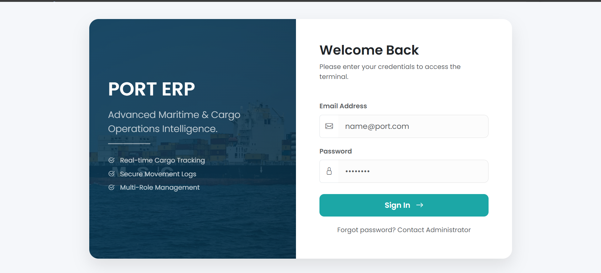

### 📦 Cargo Management Module
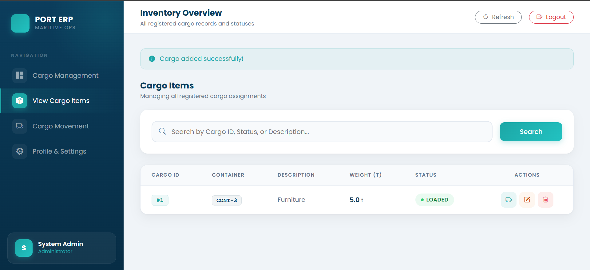  
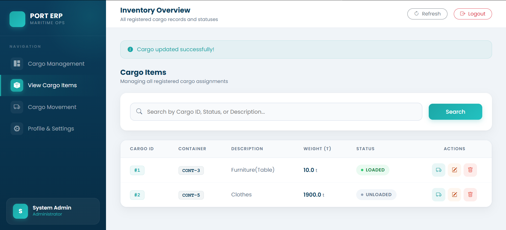
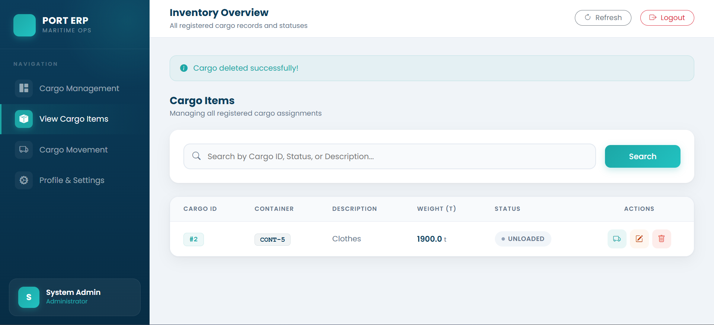

### 🚚 Cargo Tracking Module
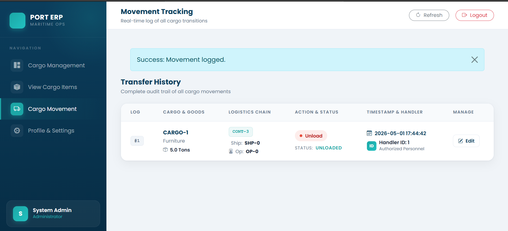  
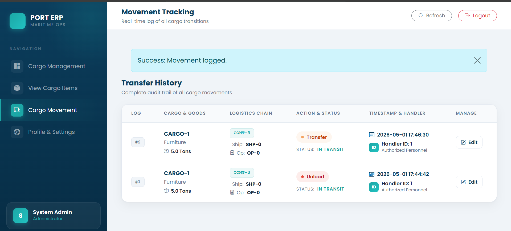

### 📊 Dashboard
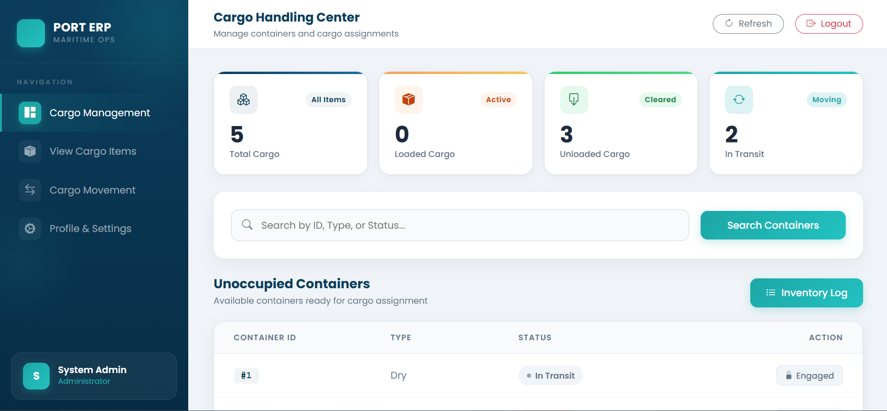
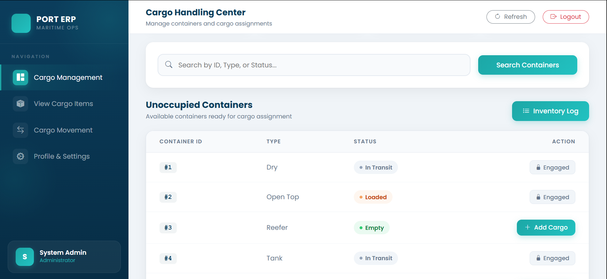

### Form
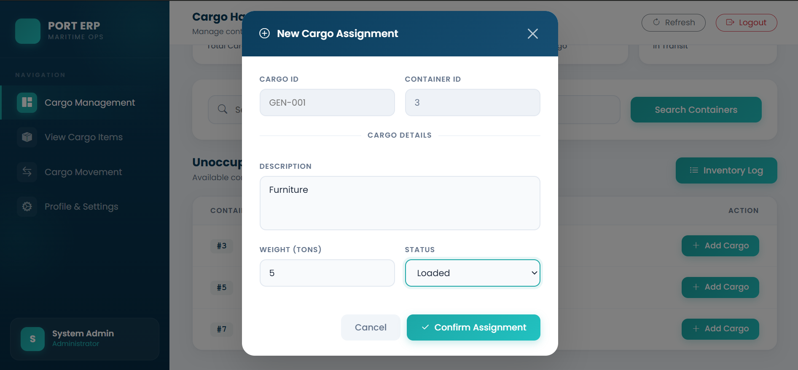
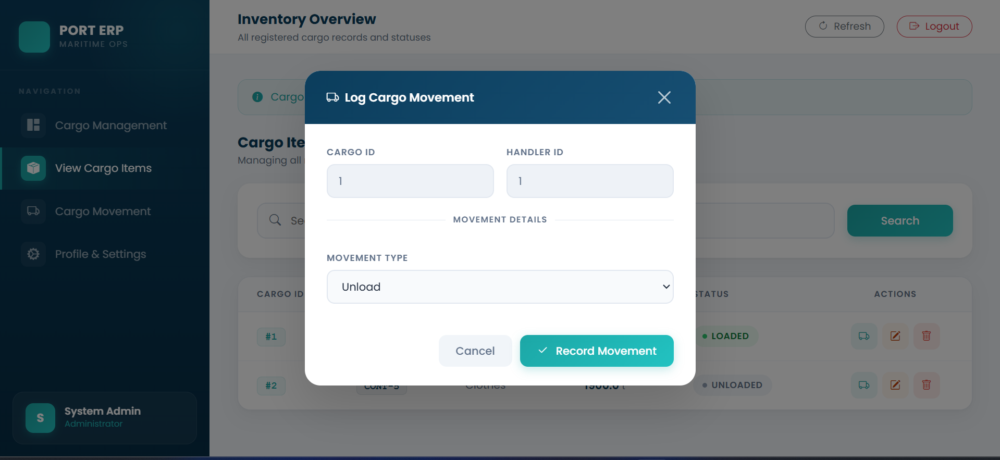
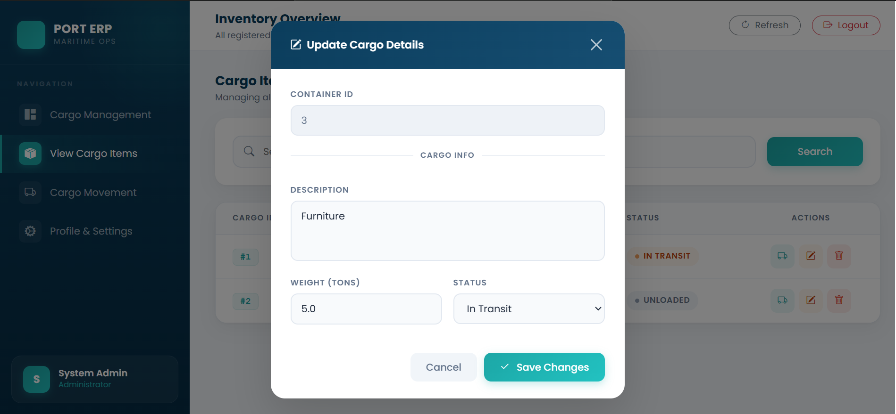

## 🎯 Project Objective

This system is designed to simplify cargo logistics operations by providing an easy-to-use interface for managing cargo records, tracking movements, and maintaining a complete history of shipments.
